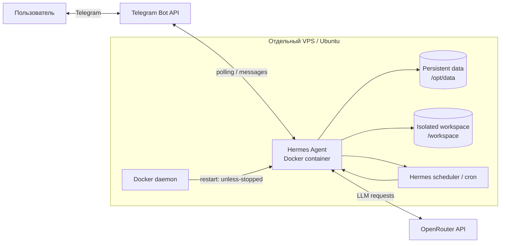

# web-eco-task-2

Практическая работа по курсу «Проектирование и развертывание веб-решений в экосистеме Python».

Выбранные задания:

- **T3 — модель угроз и безопасность автономного агента**;
- **P1 — развертывание агента и доказательство его автономности**.

В качестве автономного агента используется **Hermes Agent**. Он запускается в отдельном Docker-контейнере на изолированном VPS, общается с пользователем через Telegram и использует внешний LLM-провайдер (для лабораторной — OpenRouter).

## Архитектура



### Границы безопасности

- агент работает на отдельном VPS, на котором нет личных данных и рабочих проектов;
- управление VPS выполняется от непривилегированного пользователя;
- Hermes изолирован Docker-контейнером;
- внутрь контейнера монтируются только `./data` и `./workspace`;
- Docker socket и домашний каталог хоста в контейнер **не передаются**;
- наружу не публикуются TCP-порты — Telegram работает через исходящие соединения;
- Telegram-доступ ограничивается `TELEGRAM_ALLOWED_USERS`;
- API-ключи и токены хранятся в `data/.env`, который не попадает в Git;
- для контейнера включен `no-new-privileges`, privileged mode не используется;
- Docker-логи ротируются;
- `restart: unless-stopped` обеспечивает автоматическое восстановление после перезагрузки VPS.

## Структура репозитория

```text
.
├── compose.yml
├── README.md
├── .gitignore
├── scripts/
│   ├── create-lab-user.sh       # разово: создать non-root user на VPS, если есть только root
│   ├── bootstrap-host.sh        # первичная подготовка Ubuntu/VPS
│   ├── setup.sh                 # первоначальная настройка Hermes
│   ├── start.sh
│   ├── stop.sh
│   ├── restart.sh
│   ├── status.sh
│   ├── logs.sh
│   ├── update.sh
│   ├── verify.sh                # проверки конфигурации P1
│   ├── smoke-test.sh            # terminal + files + web
│   ├── create-demo-cron.sh      # автономная cron-задача для демонстрации
│   ├── cron-list.sh
│   ├── test-skill.sh
│   └── collect-evidence.sh      # сохранить данные для отчета
├── templates/
│   └── memories/
│       ├── USER.md
│       └── MEMORY.md
├── skills/
│   └── research-source-check/
│       └── SKILL.md
├── docs/
│   ├── threat-model.md
│   ├── debugging-log.md
│   └── evidence-checklist.md
├── data/                        # runtime Hermes, создается локально, gitignored
└── workspace/                   # рабочий каталог агента, gitignored
```

## 1. Требования

Рекомендуемый VPS:

- Ubuntu 22.04+;
- 1–2 vCPU;
- 1–2 GB RAM;
- 15+ GB диска;
- SSH-доступ по ключу.

Локальная GPU не требуется: модель вызывается через API.

## 2. Подготовка чистого VPS

### Если провайдер уже выдал non-root пользователя с sudo

Сразу клонировать репозиторий и запустить bootstrap:

```bash
git clone https://github.com/DmitryLedentsov/web-eco-task-2.git
cd web-eco-task-2
bash scripts/bootstrap-host.sh
```

### Если на свежем VPS есть только root

Один раз под root:

```bash
git clone https://github.com/DmitryLedentsov/web-eco-task-2.git /tmp/web-eco-task-2
cd /tmp/web-eco-task-2
bash scripts/create-lab-user.sh hermeslab
```

Скрипт создаст пользователя `hermeslab`, добавит его в `sudo`, перенесет root `authorized_keys` (если он есть) и предложит задать локальный пароль для sudo.

После этого открыть **новую SSH-сессию как `hermeslab`**, заново клонировать репозиторий в его home и выполнить:

```bash
git clone https://github.com/DmitryLedentsov/web-eco-task-2.git
cd web-eco-task-2
bash scripts/bootstrap-host.sh
```

`bootstrap-host.sh`:

1. устанавливает обновления и необходимые пакеты;
2. устанавливает Docker Engine и Compose plugin из официального репозитория Docker;
3. добавляет текущего пользователя в группу `docker`;
4. включает UFW (`deny incoming`, `allow outgoing`, `OpenSSH`);
5. при наличии SSH-ключа отключает вход по паролю и root-login.

После добавления пользователя в группу Docker нужно один раз переподключиться по SSH либо выполнить:

```bash
newgrp docker
```

Проверка:

```bash
docker version
docker compose version
```

> Не запускайте агента на машине с личными файлами, рабочими ключами и другими проектами. Для задания предполагается отдельный VPS/VM.

## 3. Получение LLM API key

Для лабораторной удобно использовать OpenRouter.

1. Зарегистрироваться на <https://openrouter.ai/>.
2. Создать API key.
3. При настройке Hermes выбрать OpenRouter.
4. Выбрать доступную модель с контекстным окном **не менее 64K токенов**. Для лабораторной можно использовать бесплатную модель `:free`, если она доступна на момент запуска.

Секрет будет сохранен самим Hermes в `data/.env`; в Git он не коммитится.

## 4. Создание Telegram-бота

1. Открыть `@BotFather`.
2. Выполнить `/newbot` и получить bot token.
3. Узнать свой числовой Telegram user ID, например через `@userinfobot`.
4. При настройке Hermes указать **только свой ID** в `TELEGRAM_ALLOWED_USERS`.

Не использовать `*` и не включать allow-all.

## 5. Первоначальная настройка Hermes

Запустить:

```bash
bash scripts/setup.sh
```

Скрипт:

- создает runtime-каталоги;
- скачивает Docker image Hermes;
- запускает интерактивный `hermes setup`;
- запускает `hermes gateway setup` для Telegram;
- фиксирует рабочий каталог агента как `/workspace`;
- копирует шаблоны `USER.md` / `MEMORY.md`;
- устанавливает собственный skill `research-source-check`;
- проверяет отсутствие очевидно опасной Telegram-конфигурации.

После setup:

```bash
bash scripts/start.sh
bash scripts/status.sh
bash scripts/verify.sh
```

## 6. Проверка обязательных инструментов

Задание требует проверить web, работу с файлами и запуск команд. Для этого есть один smoke test:

```bash
bash scripts/smoke-test.sh
```

Он просит агента:

1. выполнить `date -u` через terminal;
2. создать `/workspace/p1-smoke.txt` через file tool;
3. прочитать файл обратно;
4. загрузить `https://example.com` через web tool.

Успех каждого шага должен подтверждаться реальным tool call, а не текстовым утверждением модели.

Scheduler проверяется отдельно через cron ниже.

## 7. Обычное управление

```bash
bash scripts/start.sh      # поднять контейнер
bash scripts/stop.sh       # остановить
bash scripts/restart.sh    # перезапустить
bash scripts/status.sh     # состояние контейнера
bash scripts/logs.sh       # follow логов
bash scripts/update.sh     # pull нового image + recreate
bash scripts/verify.sh     # проверки P1
```

## 8. Проверка Telegram allowlist

С основного аккаунта отправить боту сообщение и убедиться, что он отвечает.

Затем написать боту с другого Telegram-аккаунта. Hermes должен отклонить запрос или не разрешить работу с агентом. Этот результат нужно зафиксировать скриншотом для отчета.

## 9. Проверка памяти

Шаблоны находятся в:

```text
data/memories/USER.md
data/memories/MEMORY.md
```

После запуска открыть новый диалог и задать вопрос, ответ на который следует только из этих файлов, например:

> Какой формат ответов и язык я предпочитаю, и для какой лабораторной ты запущен?

После этого проверить сами файлы:

```bash
cat data/memories/USER.md
cat data/memories/MEMORY.md
```

## 10. Проверка собственного skill

Skill `research-source-check` устанавливается автоматически.

Проверка:

```bash
bash scripts/test-skill.sh https://hermes-agent.nousresearch.com/
```

Или через Telegram:

```text
/research-source-check https://hermes-agent.nousresearch.com/
```

Ожидаемый результат: агент извлекает сведения из источника, явно отмечает отсутствующие данные и не выдумывает недоступные факты.

## 11. Автономная cron-задача

Для P1 создается простая периодическая задача, которая запускается без открытого Telegram-клиента и отправляет результат обратно в Telegram.

Для личного диалога `CHAT_ID` обычно совпадает с вашим Telegram user ID:

```bash
bash scripts/create-demo-cron.sh <CHAT_ID>
```

Можно передать собственный интервал вторым аргументом:

```bash
bash scripts/create-demo-cron.sh <CHAT_ID> 'every 5m'
```

Посмотреть задания:

```bash
bash scripts/cron-list.sh
```

Задача выполняет небольшой health-check внутри изолированного окружения и сообщает UTC-время, uptime и свободное место. Для демонстрации можно временно поставить короткий интервал, дождаться сообщения при закрытом Telegram-клиенте, сделать скриншот, а затем удалить/отключить задачу.

## 12. Доказательство автозапуска после reboot

До перезагрузки:

```bash
bash scripts/status.sh
bash scripts/collect-evidence.sh before-reboot
```

Перезагрузить VPS:

```bash
sudo reboot
```

После повторного входа **не запускать контейнер вручную**:

```bash
cd web-eco-task-2
bash scripts/status.sh
bash scripts/collect-evidence.sh after-reboot
```

Контейнер должен иметь состояние `running` благодаря `restart: unless-stopped`.

## 13. Что собрать для отчета P1

Минимальный набор:

- `compose.yml` с комментариями;
- лог успешного старта;
- скриншот диалога с агентом через Telegram;
- скриншот отказа постороннему Telegram-аккаунту;
- результат `verify.sh`;
- результат `smoke-test.sh`;
- доказательство работы cron;
- состояние контейнера после reboot без ручного запуска;
- скриншот страницы LLM-провайдера с лимитом расходов / подтверждением бесплатного режима;
- минимум три реальные ошибки настройки: текст ошибки → гипотеза → проверка → решение;
- сведения о VPS: провайдер, тариф, регион, CPU/RAM/disk, стоимость;
- фактические время отклика и расходы.

Шаблоны для фиксации результатов лежат в `docs/`.

## 14. T3 — безопасность

Начальная модель угроз находится в [`docs/threat-model.md`](docs/threat-model.md). Для каждой угрозы фиксируются:

- угроза;
- вектор;
- контрмера;
- остаточный риск.

Ключевой принцип этой лабораторной: **изоляция уменьшает последствия ошибки агента, но не делает недоверенный контент безопасным**. Prompt injection, утечка данных через разрешенный исходящий трафик и компрометация цепочки поставок остаются принципиальными рисками.

## Полезные команды Docker

```bash
docker compose ps
docker compose logs --tail=200 hermes
docker inspect web-eco-task-2-hermes --format '{{.HostConfig.RestartPolicy.Name}}'
docker inspect web-eco-task-2-hermes --format '{{.Config.Image}}'
```

## Важно

- Никогда не коммитить `data/.env`.
- Не использовать на этом VPS SSH-ключи от рабочих серверов и production-токены.
- Не монтировать `/var/run/docker.sock` в Hermes.
- Не запускать контейнер с `--privileged`.
- Не включать Telegram allow-all.
- При случайной публикации токена или API key — немедленно отозвать и перевыпустить его.
